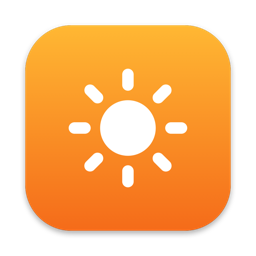
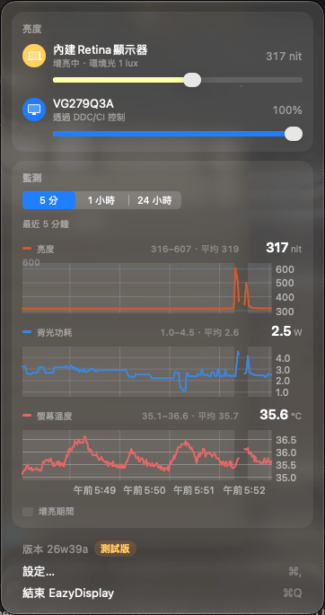
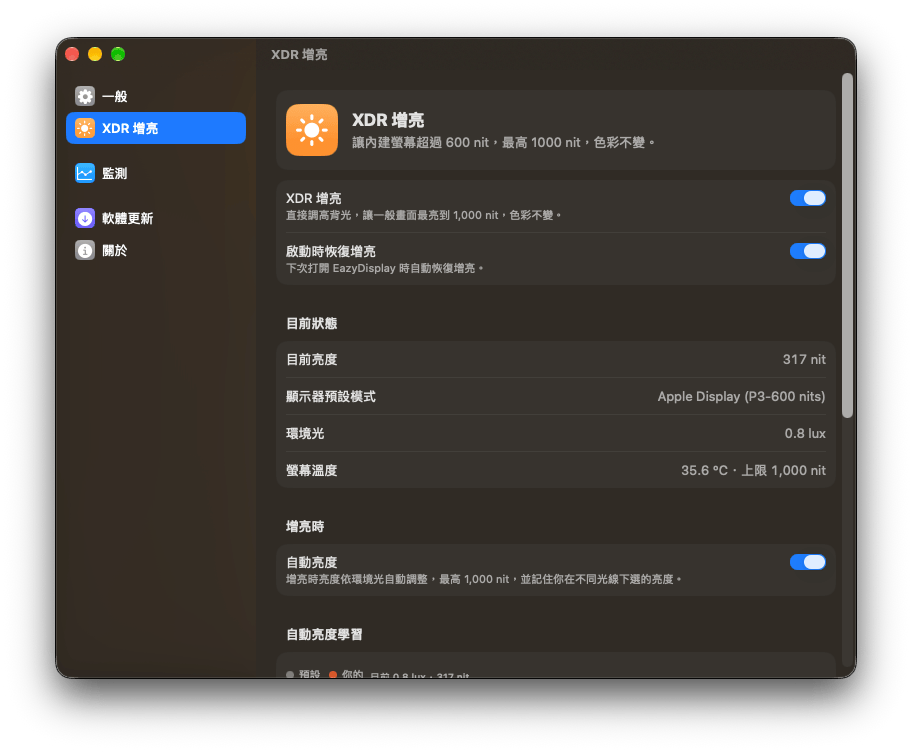
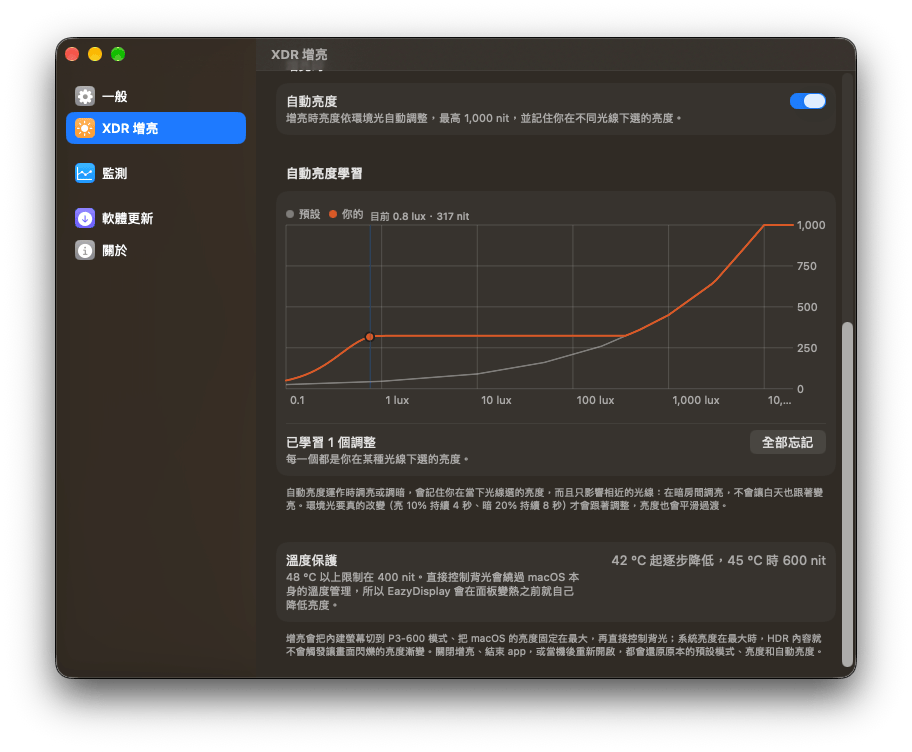
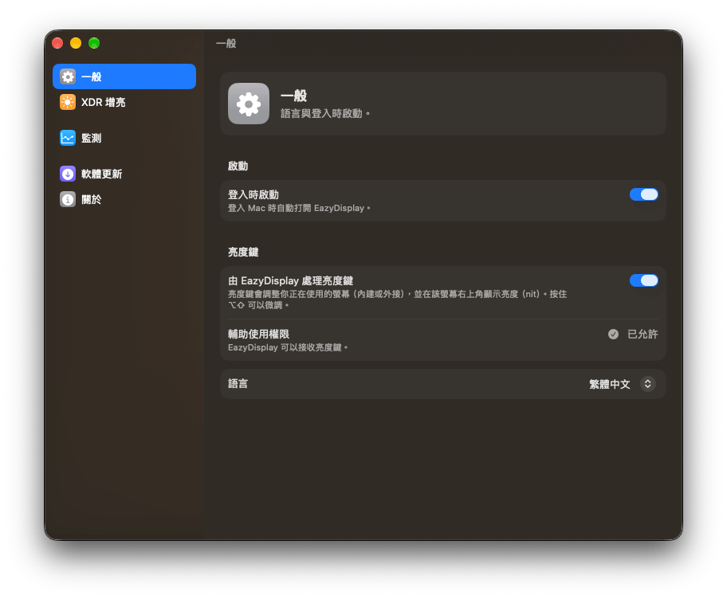
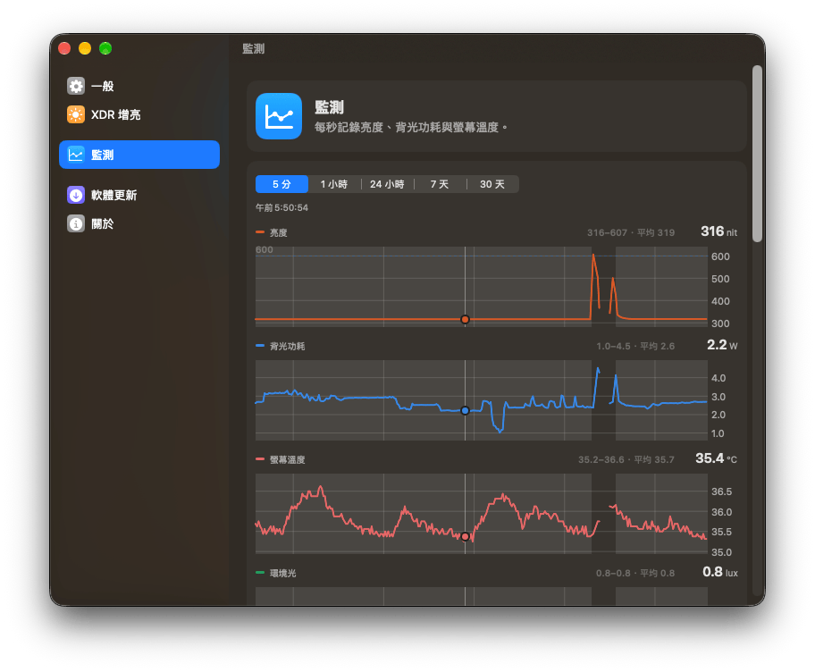
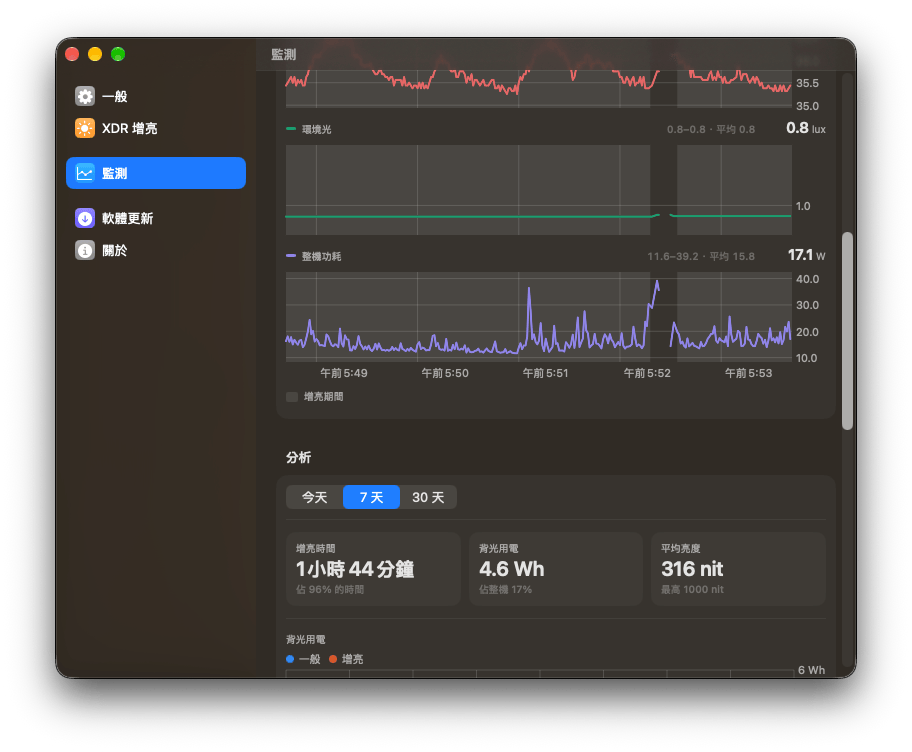
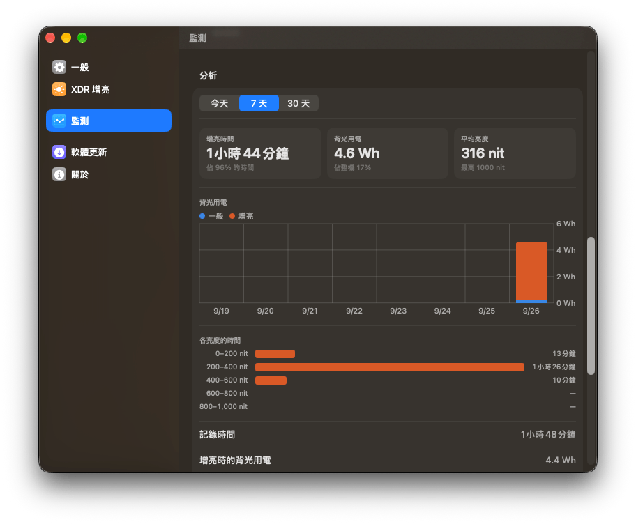
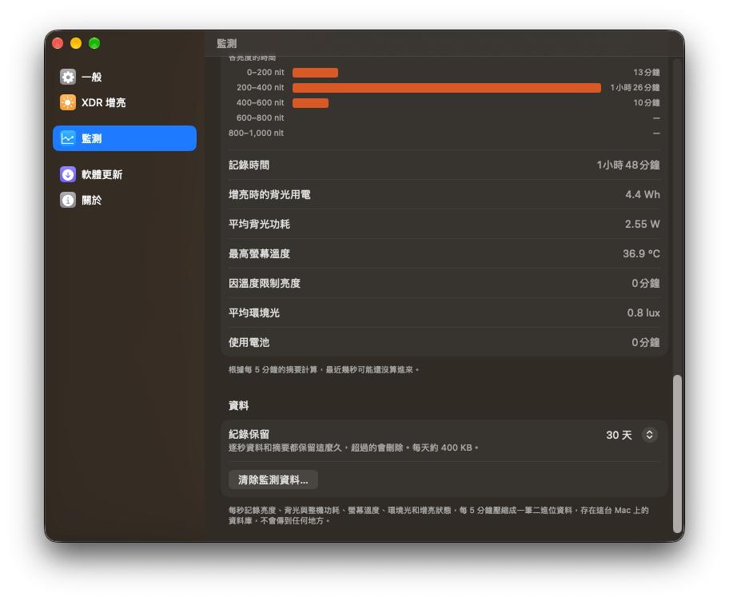

<div align="center">



# EasyDisplay

**macOS のメニューバーでディスプレイの明るさを調整 —— MacBook Pro の XDR ディスプレイを、普段の画面でも色を変えずに 1000 nit まで明るくできます。**


[](https://github.com/ExpTechTW/EasyDisplay/releases/latest)

[](https://github.com/ExpTechTW/EasyDisplay/releases)

[](https://github.com/ExpTechTW/EasyDisplay/actions/workflows/release.yml)

[](#ダウンロード)

[](https://discord.gg/5dbHqV8ees)


[繁體中文](README.md) • [English](README.en.md) • **日本語**


[ダウンロード](https://github.com/ExpTechTW/EasyDisplay/releases/latest) • [更新履歴](https://github.com/ExpTechTW/EasyDisplay/releases) • [問題を報告](https://github.com/ExpTechTW/EasyDisplay/issues)

</div>

## EasyDisplay とは

EasyDisplay は、メニューバーに常駐する macOS のディスプレイの明るさツールです。MacBook Pro の Liquid Retina XDR ディスプレイは、普段の（SDR の）画面では 600 nit までしか明るくならず、それ以上は HDR コンテンツのためだけに取ってあります。EasyDisplay はバックライトを直接上げて、普段の画面も 1000 nit まで明るくします。

変えるのはバックライトだけで、ピクセルの拡大やカラーマネジメントには手を加えないので、色はこれまでどおり正確です。ブースト中は周囲の明るさに合わせて明るさを調節し、光の状態ごとの好みを覚えることもできます。外部ディスプレイの明るさも同じ場所で調整できます。

## スクリーンショット

画面は繁體中文表示のものです。

<table>
<tr>
<td align="center"><br>メニューバーのパネル：ディスプレイごとの明るさとリアルタイムのモニタ</td>
<td align="center"><br>XDR ブースト：オン・オフ、現在の状態、明るさの自動調節</td>
</tr>
</table>

<table>
<tr>
<td align="center"><br>明るさの自動調節の学習：学習した曲線と温度保護</td>
<td align="center"><br>一般：ログイン時に開く・明るさキー・言語</td>
</tr>
<tr>
<td align="center"><br>モニタ：明るさ・バックライトの電力・ディスプレイ温度</td>
<td align="center"><br>モニタ：周囲の明るさとシステムの電力</td>
</tr>
<tr>
<td align="center"><br>分析：ブースト時間・バックライトの電力量・明るさごとの時間</td>
<td align="center"><br>分析の詳細とデータの保存期間</td>
</tr>
</table>

## できること

| | |
|---|---|
| **XDR ブースト** | 内蔵 XDR ディスプレイのバックライトを直接上げ、普段の画面を色を変えずに最大 1000 nit まで明るくします。ブーストをオフにしたとき、アプリを終了したとき、クラッシュ後に開き直したときは、元のディスプレイプリセット・明るさ・明るさの自動調節に戻します |
| **ブースト中の明るさの自動調節** | 環境光センサーに合わせて最大 1000 nit まで調節します。周囲の明るさが本当に変わったとき（10% 明るい状態が 4 秒、20% 暗い状態が 8 秒続いたとき）だけ追従し、明るさは飛ばずになめらかに変わります |
| **好みを学習** | 明るさの自動調節中にスライダや明るさキーで調整すると、その光の状態で選んだ明るさを覚えます。影響するのは近い明るさの環境だけで、暗い部屋で明るくしても日中まで明るくはなりません。学習した曲線は設定で確認でき、すべて忘れることもできます |
| **温度保護** | バックライトを直接制御すると macOS の温度管理を通らないため、EasyDisplay がパネルが熱くなる前に自分で上限を下げます：ディスプレイ温度 42 °C から徐々に下げ、45 °C で 600 nit、48 °C 以上で 400 nit |
| **明るさキー** | キーボードの明るさキーを引き受け、使用中のディスプレイ（最前面のウインドウがあるディスプレイ、なければポインタがあるディスプレイ）を内蔵・外部を問わず調整し、そのディスプレイの右上に明るさ（nit）を表示します。⌥⇧ を押しながらで細かく調整できます |
| **外部ディスプレイ** | メニューバーから外部ディスプレイの明るさを調整できます：Apple のディスプレイはシステム経由、それ以外は DDC/CI で制御します |
| **モニタ** | 明るさ・バックライトの電力・システムの電力・ディスプレイ温度・周囲の明るさを毎秒記録し、直近 5 分から 30 日までのグラフで確認できます。どれか 1 つのグラフを指すと、すべてのグラフに同じ時刻の値が表示され、ブースト中の期間は背景色で示されます |
| **分析** | 今日・7 日・30 日のブースト時間、バックライトの電力量（1 時間ごとまたは 1 日ごと、通常とブーストを分けて）、システム全体に占める割合、平均と最大の明るさ、明るさごとの時間、最高温度、平均の周囲の明るさ。データはこの Mac にだけ 30・90・365 日間保存され、1 日あたり約 400 KB です |
| **メニューバーに明るさを表示** | メニューバーのアイコンの横に内蔵ディスプレイの明るさを表示し、ブースト中は太陽のアイコンが塗りつぶしになります |
| **自動アップデート** | Apple の公証を受けたアップデートを GitHub から取得し、同じ開発者が署名したものだけをインストールします。テスト版を受け取ることもできます |
| **3 つの言語** | 繁體中文・English・日本語。通常はシステムに合わせ、設定で切り替えることもできます |

## ダウンロード

**macOS 26 以降**と Apple シリコンが必要です。XDR ブーストには Liquid Retina XDR ディスプレイを搭載した MacBook Pro が必要です。

1. [Releases](https://github.com/ExpTechTW/EasyDisplay/releases/latest) から `EasyDisplay-<バージョン>.zip` をダウンロードして展開し、EasyDisplay.app を「アプリケーション」フォルダに移動してから開きます。Apple の公証を受けているので、そのまま開けます。
2. 初めて開くと、EasyDisplay が明るさキーを受け取るために macOS が「アクセシビリティ」へのアクセスを求めるので、許可します。メニューバーのパネルや「設定 › 一般」の「許可…」からも許可できます。
   - ダイアログが表示されない場合や以前拒否した場合：「システム設定 › プライバシーとセキュリティ › アクセシビリティ」を開き、EasyDisplay をオンにします。
   - 許可しないと明るさキーは macOS が処理し、ブースト中は明るくするキーが効きません。
3. 「設定 › XDR ブースト」で「XDR ブースト」をオンにします。再起動後もブーストを戻すには、「設定 › 一般」で「ログイン時に開く」をオンにします。「起動時にブーストを戻す」は最初からオンです。

EasyDisplay は起動時とその後 6 時間ごとにアップデートを確認し、新しいバージョンがあればお知らせします。「設定 › ソフトウェアアップデート」の「今すぐ確認」ですぐに確認することもできます。メニューバーのアイコンが隠れているときは、Finder や Spotlight から EasyDisplay をもう一度開くと設定ウインドウが表示されます。

### 正式版とテスト版

| | 名前 | 公開のタイミング |
|---|---|---|
| 正式版 | `26.1`：年と番号 | 手動で公開 |
| テスト版 | `26w39a`：年、週、その週の何番目か | `main` へのプッシュごとに自動で公開。確認されていないため、問題がある場合があります |

新しいビルドをいち早く試すには、「設定 › ソフトウェアアップデート」で「テスト版を受け取る」をオンにします。正式版は正式版にだけ、テスト版はテスト版にだけアップデートされます。メニューバーのパネルの下部には使用中のバージョンが表示され、テスト版はオレンジ、正式版は緑のラベルが付きます。

## 既知の制限

- XDR ブーストは、今のところ M4 Max の MacBook Pro でしか実機で確認していません。
- ブースト中は「Apple Display (P3-600 nits)」プリセットを使うため、HDR 動画でも白より明るいハイライトは出ません。HDR コンテンツを見るときはブーストをオフにしてください。
- ブースト中は macOS の明るさが最大に固定されるので、EasyDisplay のスライダか明るさキーで調整してください。コントロールセンターの明るさスライダは、動かしても最大に戻ります。
- BetterDisplay など、同じようにバックライトを直接制御するツールとは同時に使わないでください。互いに明るさを書き換えてしまいます。
- 外部ディスプレイの明るさを調整するには DDC/CI への対応が必要です。対応していないディスプレイや変換アダプタもあります。
- EasyDisplay は macOS の非公開 API を使っています。今後の macOS のアップデートで一部の機能が一時的に使えなくなる可能性があり、App Store でも配布できません。

## 開発

ビルドには macOS 26 以降、Xcode 26 以降（macOS 26 SDK のため）、そして [mise](https://mise.jdx.dev) が必要です。Swift のバージョンは [mise.toml](mise.toml) で固定され、どの Mac でも CI でも同じものを使います。

```bash
git clone https://github.com/ExpTechTW/EasyDisplay.git
cd EasyDisplay
mise install                          # mise.toml で指定された Swift をインストール
git config core.hooksPath .githooks   # コミット時にコミットメッセージを確認
mise exec -- swift test               # テストを実行
scripts/build-app.sh                  # build/EasyDisplay.app をビルド
open build/EasyDisplay.app
```

- `scripts/build-app.sh` はキーチェーンの証明書で署名します。Developer ID Application を優先し、なければ Apple Development を使います。どちらもない場合はアドホック署名になり、ビルドのたびに macOS が許可を求め、アップデートもできません。
- `swift run` でも実行できますが、アクセシビリティの許可がターミナルに付与されるため、ビルドしたアプリを使うことをおすすめします。
- コミットメッセージがそのまま更新履歴になります。書式は [commit.md](commit.md)（繁体字中国語）にあり、git フックと CI で確認されます。
- `Experiments/DirectUpscalingTest.swift` は、このブーストの方法を見つけて確かめるために使ったコマンドラインツールです。

### 仕組み

ブーストをオンにすると、EasyDisplay は次のことを行います。

1. 現在のディスプレイプリセット、明るさのスライダ、明るさの自動調節、バックライトの上限を記録します。ブーストをオフにしたとき、終了したとき、クラッシュ後に開き直したときは、この記録どおりに戻します。
2. システムの明るさの自動調節をオフにし、「Apple Display (P3-600 nits)」プリセットに切り替えて、macOS の明るさを最大に固定します。
3. 内蔵ディスプレイの `IOMobileFramebufferShim` に `IOMFBIndicatorNitsCap`・`BLNitsCap`・`limit_max_physical_brightness`、続いて `IOMFBBrightnessLevel`（いずれも 16.16 固定小数点の nit）を書き込み、バックライトを直接設定します。

macOS の明るさが最大だと、corebrightnessd にとっての白はこのプリセットの HDR の上限 600 nit になり、EDR ヘッドルームは 1 のままです。そうでないと、アプリが HDR を求めるたびに corebrightnessd が EDR ランプを始めます。約 2 秒間バックライトを書き換え続けて SDR のピクセルを暗くし、EasyDisplay が書き戻すのと引っ張り合いになって、ちらつきとして見えます。明るさを固定しているため、明るさキーは EasyDisplay が自分で処理します。

- **バックライト**：`BacklightDriver` がメインスレッドではなく専用のキューで保ちます。1 秒に 30 回バックライトを 1 度だけ読み、ほかから書き換えられていたら（スリープ解除、プリセットの切り替え、True Tone）1 周期以内、約 10〜20 ms で書き戻します。ディスプレイがオフのときは何もしません。新しい明るさへは、対数目盛りで 1 段ずつなめらかに近づきます。それ以外の処理は 1 秒ごとのセンサーのサンプルとともに行い、スライダと明るさキーはすぐに反映します。
- **明るさの自動調節**：corebrightnessd の `AggregatedLux` は、システムの明るさの自動調節がオフでも更新され続けます。`AmbientFilter`（Android の AutomaticBrightnessController にならい、速い平均と遅い平均、ヒステリシスの幅、待ち時間を持つ）が追従する明るさを決め、曲線がそれを明るさに換算します。曲線は `AmbientLight.curve` から始まり、調整のたびにその光の状態の点が 1 つ増えます（Android 9 以降と同じ）。点のあいだは対数目盛りで補間し、範囲の外はガウス関数で既定の曲線に戻し、最新の点から外側へ単調になるようにします。
- **なぜ 1000 nit か**：全面が白い画面では、パネルは約 17.6 W、約 1100 nit で電力の上限に達します。1000 nit にとどめれば、明るさが画面の内容で変わりません。
- **モニタのデータ**：`~/Library/Application Support/io.github.yuyu1015.EasyDisplay/Monitor.sqlite` に保存します。5 分ごとに 1 件のバイナリデータ（Float16、差分、バイトプレーン、LZMA 圧縮。平均で 1 秒あたり約 4〜6 バイト）と、長い期間のグラフと分析が読む 5 分ごとの要約があります。
- **ログ**：`log stream --predicate 'subsystem == "io.github.yuyu1015.EasyDisplay"'`

| ファイル | 内容 |
|---|---|
| `BuiltInDisplay.swift` | 内蔵ディスプレイ：ブーストのオン・オフと復元、目標の明るさ、明るさの自動調節、温度による上限 |
| `BacklightDriver.swift`、`BuiltInFramebuffer.swift` | 専用のキューでのバックライトの維持と変化；バックライトのプロパティの読み書き |
| `AutoBrightness.swift`、`AmbientLight.swift` | 周囲の明るさのフィルタと学習した曲線；周囲の明るさの読み取り、既定の曲線 |
| `DisplayManager.swift`、`ExternalDisplay.swift`、`DDC.swift` | ディスプレイの一覧と明るさキーの振り分け；外部ディスプレイと DDC/CI |
| `BrightnessKeys.swift`、`BrightnessOSD.swift` | 明るさキーの受け取りと使用中のディスプレイの判定；明るさの表示 |
| `DisplayPresets.swift`、`PrivateFrameworks.swift` | ディスプレイプリセット；DisplayServices とタイムアウト |
| `SensorMonitor.swift`、`SMC.swift` | 毎秒のサンプリング；SMC からの電力と温度の読み取り |
| `MonitorDatabase.swift`、`SampleCodec.swift`、`MonitorChartModel.swift` | SQLite への保存、圧縮形式、グラフのデータ |
| `TrayView.swift`、`SettingsWindow.swift`、`SettingsView.swift`、`MonitorCharts.swift`、`MonitorAnalysisView.swift`、`AutoCurveChart.swift`、`Components.swift` | メニューバーのパネル、設定ウインドウとその各ページ、グラフと共通のコントロール |
| `Update.swift`、`Updater.swift` | 自動アップデート：バージョンの比較、ダウンロード、検証、置き換え |
| `AppSettings.swift`、`Localization.swift` | 設定；表示言語 |

### 公開

ルールは DPIP と同じです。`main` へのプッシュごとにテスト版が、`v<yy>.<n>` タグ（例：`v26.1`）で正式版が公開されます。どのビルドも Developer ID で署名して Apple の公証を受け、更新履歴はコミットの項目行から自動で作られ（[commit.md](commit.md) を参照）、Discord に投稿されます。
